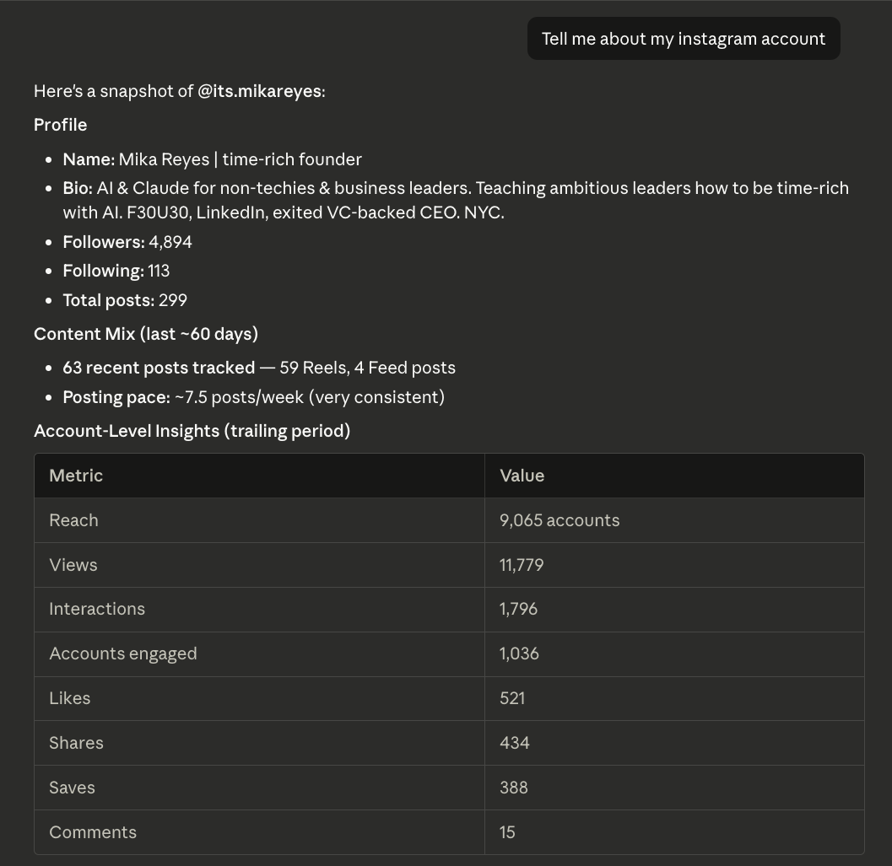

# Instasights

<p align="center">
  <a href="#install"></a>
  <a href="./LICENSE"></a>
</p>

<p align="center">
  <a href="./apps/web"></a>
  <a href="./packages/cli"></a>
  <a href="./services/transcriber"></a>
</p>

Instasights is a skill-first Instagram analytics workflow built around one installable skill, a bundled Node-powered CLI, a hosted REST API, and durable sync/transcription services.



## What This Repo Contains

- A hosted web app in `apps/web` that exposes `/`, `/developers`, OAuth routes, `/api/login`, `/api/callback`, and `/api/v1/*`.
- A bundled CLI in `packages/cli` that authenticates with OAuth PKCE, stores tokens inside the installed skill folder, and wraps the hosted API.
- Shared packages in `packages/*` for contracts, database access, and infrastructure definitions.
- A transcriber service in `services/transcriber` used by the sync pipeline.
- One installable skill under `skills/instasights`.

## Install

Add the repository as a Claude marketplace and install the skill package:

```text
/plugin marketplace add https://github.com/kingscrosslabs/marketplace.git
/plugin install instagram@kingscrosslabs-marketplace
```

The CLI requires Node.js 20 or newer. After install, run the skill launcher so it can execute the bundled MJS runtime from the skill:

```bash
./skills/instasights/instasights auth login
./skills/instasights/instasights setup status
./skills/instasights/instasights sync run --wait
./skills/instasights/instasights media analyze --days 30
./skills/instasights/instasights report generate --days 30
```

## Supported CLI Commands

- `auth login`
- `auth status`
- `auth logout`
- `setup status`
- `account overview`
- `snapshot latest`
- `media list [--days <n>] [--flat-metrics]`
- `media get <mediaId>`
- `media analyze [--days 30]`
- `report generate [--days 30] [--output <path>]`
- `sync list`
- `sync get <syncRunId>`
- `sync run [--wait]`
- `instagram link [--open]`
- `update check [--apply] [--force]`
- `update apply [--force]`

All data-returning commands default to JSON output. Networked commands also emit structured JSON progress logs on stderr by default so long-running steps like `sync run --wait` explain what is happening and how long they may take.

`report generate` is the static export path: it writes a self-contained HTML dashboard to disk using existing report and media data, without making any extra model API call.

## CLI Updates

- The committed skill launcher executes `node skills/instasights/bin/instasights.mjs` after verifying Node.js 20+ is available.
- The skill now ships with committed MJS runtime files in `skills/instasights/bin/` instead of bootstrapping a separate runtime download on first run.
- The installed CLI continues checking for newer releases through its normal self-update flow.
- Published CLI bundles are versioned independently and store the installed version in `skills/instasights/bin/instasights.version.json`.
- The skill ships with `skills/instasights/.skillignore` so `.auth/` and `.cache/` stay local-only and are excluded from SkillTree sync/publish.
- If the version file is missing, the updater treats the install as legacy and prefers the newest published release.
- To inspect or force the updater manually, run:

```bash
./skills/instasights/instasights update check
./skills/instasights/instasights update apply
./skills/instasights/instasights update check --apply --force
```

## Auth Model

- The CLI registers a public OAuth client against `/oauth/register`.
- The browser handoff completes Google sign-in on the hosted app.
- The CLI receives the callback on `127.0.0.1`, exchanges the code at `/oauth/token`, and stores auth state in `skills/instasights/.auth/state.json`.
- Runtime-only skill data remains local inside `skills/instasights/.auth/` and `skills/instasights/.cache/`; those paths are excluded by `skills/instasights/.skillignore`.
- Instagram linking still happens through the hosted `/api/login` handoff.

## Hosted API

The skill and CLI talk to the authenticated REST surface under `/api/v1/*`:

- `GET /api/v1/account`
- `GET /api/v1/snapshot/latest`
- `GET /api/v1/media`
- `GET /api/v1/media/:mediaId`
- `GET /api/v1/report?days=30`
- `GET /api/v1/sync-runs`
- `GET /api/v1/sync-runs/:syncRunId`
- `POST /api/v1/sync-runs`

Legacy developer API keys are still supported for compatibility scripts.

## MCP Deprecation

- `/mcp` now returns `410 Gone`.
- `/.well-known/oauth-protected-resource/mcp` now returns `410 Gone`.
- The supported path is the Instasights skill plus bundled CLI.

## Local Development

Install dependencies:

```bash
yarn install --frozen-lockfile
```

Useful commands:

```bash
yarn build:cli
yarn package:skill
yarn build:skill
yarn typecheck
yarn test:cli
yarn test:packaging
yarn test:web
python3 -m pytest services/transcriber/tests
```

The managed MJS runtime written into the skill lives at:

```text
skills/instasights/bin/instasights.mjs
```

## Skill Bundle Distribution

Instasights now publishes a full installable skill zip in addition to the managed CLI update files.

- Packaging command: `yarn build:cli && yarn package:skill`
- Default local output root: `packages/cli/dist/skill`
- Versioned bundle path: `packages/cli/dist/skill/<version>/instasights-skill.zip`
- Stable latest bundle path: `packages/cli/dist/skill/latest/instasights-skill.zip`
- Stable latest manifest: `packages/cli/dist/skill/latest.json`

The packaged zip expands to a top-level `instasights/` folder and includes the committed skill contents such as `SKILL.md`, `CLI.md`, `agents/openai.yaml`, `instasights`, and `bin/*`.

Local-only skill state stays out of the bundle:

- `.auth/`
- `.cache/`
- `.DS_Store`
- anything listed in `skills/instasights/.skillignore`

In CI, `.github/workflows/publish-cli.yml` publishes the existing CLI self-update artifacts under `cli/*` and the full skill bundle under `skill/*`.

For the full packaging and S3 layout details, see [docs/skill-bundle-distribution.md](/Users/nickcruz/repos/instagram-insights/docs/skill-bundle-distribution.md).

## License

MIT. See [LICENSE](./LICENSE).
